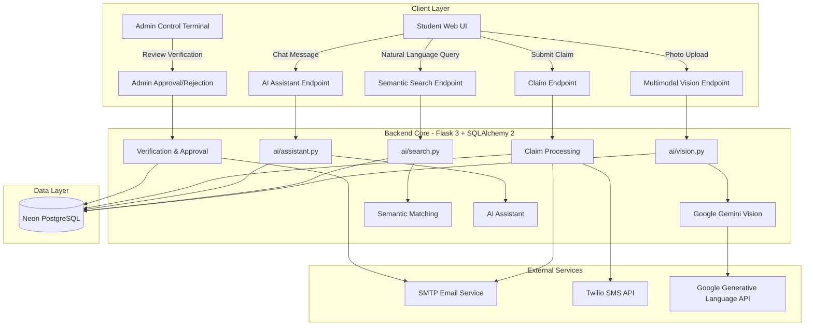

# 🎓 Campus Retain

> **AI-Powered Lost & Found Platform for University Campuses**

Campus Retain is a modern, AI-powered digital lost-and-found platform designed to help students report, discover, match, and recover lost belongings within a university campus.

The platform combines **Google Gemini multimodal AI**, intelligent search, automated lost-and-found matching, AI-assisted claim verification, email/SMS notifications, and an administrative control center into one unified system.

---

## 🚀 Overview

Losing personal belongings on campus can be frustrating, while finding an item without knowing its owner can be equally difficult.

Campus Retain provides a centralized platform where students can:

- 📱 Report lost belongings
- 📸 Report found belongings using photographs
- 🤖 Automatically analyze item images using AI
- 🔎 Search items using natural language
- 🧠 Discover AI-generated lost/found matches
- 📋 Submit ownership claims
- 🔐 Verify ownership using private proof
- 📧 Receive email notifications
- 📲 Receive SMS notifications
- 💬 Interact with an AI assistant
- 👨‍💼 Allow administrators to review and manage claims

The goal is to make campus recovery **faster, safer, smarter, and easier**.

---

## ✨ Key Features

### 🤖 AI-Powered Image Analysis

Campus Retain uses Google Gemini multimodal AI to analyze uploaded item photographs.

The AI can identify:

- Item category
- Color
- Brand
- Visible text
- Distinctive characteristics
- Other useful visual attributes

The system uses the extracted information to help students create more accurate reports.

---

### 🔎 AI Natural Language Search

Students can search using normal conversational language instead of relying only on keywords.

Examples:

```text
Black Nike backpack near the library
```

```text
Blue water bottle found near cafeteria
```

```text
White Apple charger
```

The AI extracts relevant entities such as:

- Category
- Color
- Brand
- Location
- Keywords

and uses them to improve search results.

---

### 🧠 AI Lost & Found Matching

Campus Retain continuously compares lost and found item information.

The matching engine evaluates attributes such as:

- Category
- Color
- Brand
- Location
- Description
- Visual characteristics

Potential matches can then be reviewed through the platform.

---

### 💬 AI Assistant

The integrated AI assistant helps students with questions related to the lost-and-found system.

Students can ask questions such as:

```text
How do I report a lost item?
```

```text
How can I claim an item?
```

```text
What information should I provide to prove ownership?
```

---

### 📋 Claim Management

Students can submit claims for found belongings.

Claims contain ownership proof and are reviewed by administrators before the item is released.

The system ensures that:

- Claims are associated with the authenticated student
- Student email cannot be spoofed through the request body
- Claim records are preserved even if notifications fail
- Administrators can approve or reject claims

---

### 📧 Email Notifications

Email notifications can be used for:

- Account registration
- Claim submission
- Claim approval
- Claim rejection
- Administrative remarks

---

### 📲 SMS Notifications

Twilio integration provides optional SMS notifications for important claim and recovery events.

---

### 👨‍💼 Admin Control Center

Administrators have access to a dedicated management interface for:

- Viewing reported items
- Reviewing claims
- Approving claims
- Rejecting claims
- Deleting items
- Reviewing AI match information
- Managing lost-and-found records

---

## 🏗️ System Architecture



---

## 🛠️ Tech Stack

### Backend

- Python
- Flask 3
- Flask-SQLAlchemy
- SQLAlchemy 2
- PostgreSQL
- Neon PostgreSQL

### Frontend

- HTML5
- CSS3
- JavaScript
- Tailwind CSS utilities
- Responsive UI
- Vanilla JavaScript interactions

### Artificial Intelligence

- Google Gemini
- Gemini multimodal vision
- AI natural language search
- AI lost/found matching
- AI claim verification
- AI assistant

### External Services

- Google Generative Language API
- SMTP Email
- Twilio SMS
- Vercel

---

## 🧠 AI Architecture

Campus Retain uses a provider-isolated AI architecture.

```text
AI Provider
    │
    ├── Google Gemini
    │      └── Multimodal Vision
    │
    ├── OpenAI
    │      └── Provider-supported AI operations
    │
    └── Mock/Test Provider
           └── Offline Testing
```

Provider selection is controlled using:

```env
AI_PROVIDER=google
```

Google Gemini credentials are resolved using provider-specific environment variables.

```env
AI_API_KEY=your_google_ai_api_key
```

Alternative supported Google key names include:

```env
GEMINI_API_KEY=your_google_ai_api_key
```

```env
GOOGLE_API_KEY=your_google_ai_api_key
```

---

## 👁️ Gemini Multimodal Vision

The production vision pipeline uses the Gemini Flash model configured through:

```env
AI_MODEL=gemini-3.6-flash
```

The model name can be overridden through the environment.

The image analysis request uses Google's REST API with:

- `inlineData`
- `mimeType`
- `responseMimeType`
- `systemInstruction`
- `thinkingConfig`
- Header-based API authentication

The API key is sent through:

```text
x-goog-api-key
```

and is never placed in the URL.

---

## ⚡ AI Vision Reliability

The vision system includes safeguards for production reliability.

### Request Timeout

```env
AI_TIMEOUT=15
```

### Transient Retry

The Gemini provider performs a maximum of one retry for transient:

- HTTP 429
- HTTP 503

errors.

Deterministic errors such as:

- HTTP 400
- HTTP 401
- HTTP 403
- HTTP 404

are not unnecessarily retried.

---

## 🔐 Security

Security is a core part of Campus Retain.

### Provider Key Isolation

Google Gemini never receives OpenAI credentials.

OpenAI never receives Google/Gemini credentials.

---

### Session-Based Claim Identity

Claim submissions use the authenticated session identity rather than trusting a user-provided email address.

This prevents email spoofing through client-side request manipulation.

---

### API Key Protection

API keys:

- Are stored in environment variables
- Are never sent to browser JavaScript
- Are never included in URLs
- Are never exposed in API responses
- Are masked in diagnostics

---

### Safe Error Handling

Internal exceptions and credentials are not exposed to students.

User-facing errors are converted into safe messages.

---

## 🗃️ Database

Campus Retain uses PostgreSQL for persistent application data.

The production deployment uses:

```text
Neon PostgreSQL
```

Core records include:

- Students
- Items
- Lost reports
- Claims
- AI matches
- Verification information

The application also safely handles dependent records when deleting an item.

---

## ⚡ Performance Optimizations

The application includes several backend performance improvements.

### Batch Match Queries

Instead of executing a database query for every item, match counts are retrieved using grouped aggregation queries.

This reduces unnecessary database round trips.

### Eager Loading

The admin dashboard uses eager loading for related claims and match records.

This helps prevent N+1 query patterns.

### Result

Pages such as:

- Homepage
- Student Dashboard
- Admin Dashboard

require significantly fewer database queries than the original implementation.

---

## 📱 Responsive Frontend

Campus Retain is designed for:

- 📱 Mobile
- 📱 Large mobile screens
- 📟 Tablets
- 💻 Laptops
- 🖥️ Desktop displays

The interface includes:

- Responsive navigation
- Animated cards
- Modal interactions
- AI assistant drawer
- Smooth transitions
- Accessible focus states
- Reduced-motion support

---

## 🧩 Main Application Routes

### Student

```text
/
 /login
 /dashboard
 /forgot-password
 /reset-password
```

### AI APIs

```text
POST /api/ai/chat
POST /api/ai/search
POST /api/ai/analyze-image
GET  /api/ai/matches/<id>
```

### Claim & Reporting APIs

```text
POST /api/claim
POST /api/report
POST /api/report-lost
```

### Administration

```text
/admin_login
/admin
POST /api/admin/*
POST /api/item/delete/<id>
```

---

## 📂 Project Structure

```text
CAMPUS_RETAIN_2.0/
│
├── app.py
├── requirements.txt
├── vercel.json
├── README.md
│
├── ai/
│   ├── client.py
│   ├── config.py
│   ├── exceptions.py
│   ├── vision.py
│   ├── search.py
│   ├── matching.py
│   ├── claims.py
│   └── assistant.py
│
├── app/
│   └── blueprints/
│       └── api.py
│
├── templates/
│   ├── index.html
│   ├── dashboard.html
│   ├── login.html
│   ├── reset_password.html
│   ├── admin.html
│   ├── admin_login.html
│   └── maintenance.html
│
├── static/
│   └── ...
│
└── instance/
    └── ...
```

---

## ⚙️ Local Installation

### 1. Clone the repository

```bash
git clone https://github.com/vishva3019/CAMPUS_RETAIN_2.0.git
```

### 2. Enter the project directory

```bash
cd CAMPUS_RETAIN_2.0
```

### 3. Create a virtual environment

```bash
python -m venv .venv
```

### 4. Activate the environment

macOS / Linux:

```bash
source .venv/bin/activate
```

Windows:

```bash
.venv\Scripts\activate
```

### 5. Install dependencies

```bash
pip install -r requirements.txt
```

---

## 🔑 Environment Configuration

Create a `.env` file for local development.

Example:

```env
AI_PROVIDER=google
AI_MODEL=gemini-3.6-flash
AI_API_KEY=your_google_ai_api_key
AI_TIMEOUT=15

DATABASE_URL=your_postgresql_database_url

SECRET_KEY=your_secret_key

SMTP_SERVER=your_smtp_server
SMTP_PORT=587
SMTP_USERNAME=your_email
SMTP_PASSWORD=your_email_password

TWILIO_ACCOUNT_SID=your_twilio_account_sid
TWILIO_AUTH_TOKEN=your_twilio_auth_token
TWILIO_PHONE_NUMBER=your_twilio_phone_number
```

**Never commit `.env` or real credentials to GitHub.**

---

## ▶️ Running Locally

Start the Flask application:

```bash
python app.py
```

Then open:

```text
http://127.0.0.1:5000
```

---

## ☁️ Vercel Deployment

Campus Retain can be deployed using Vercel.

Configure the required Production environment variables in the Vercel project settings.

At minimum:

```env
AI_PROVIDER=google
AI_MODEL=gemini-3.6-flash
AI_API_KEY=your_google_ai_api_key
AI_TIMEOUT=15
```

Additional database, email, SMS, and application secret variables should also be configured according to the deployment environment.

After changing environment variables, redeploy the application so the new values are available to the production runtime.

---

## 🧪 Testing

If the test suite is included in the repository, run:

```bash
python -m unittest discover tests
```

The project includes regression coverage for areas such as:

- AI provider isolation
- Gemini vision payloads
- Image upload isolation
- Claim security
- Email/SMS failure handling
- Item deletion
- Authorization
- Transaction rollback
- Performance-related query behavior
- AI transient retry handling

---

## 🛡️ Data Safety

Campus Retain is designed to avoid destructive database operations during normal application deployment.

Application-level deletion carefully handles dependent:

- Claims
- AI match records
- Items

before committing the deletion.

---

## 🌟 User Workflow

```text
Student
   │
   ▼
Report Lost / Found Item
   │
   ▼
AI Image Analysis
   │
   ▼
Extract Item Attributes
   │
   ▼
Add Item to Campus Catalog
   │
   ▼
AI Matching Engine
   │
   ├───────────────┐
   ▼               ▼
Potential Match   Student Search
   │               │
   └───────┬───────┘
           ▼
      Claim Request
           │
           ▼
    Ownership Verification
           │
           ▼
      Admin Review
       │         │
       ▼         ▼
    Approve    Reject
       │
       ▼
 Notifications
       │
       ▼
 Item Recovery
```

---

## 🎯 Project Goals

Campus Retain aims to:

1. Reduce the time required to recover lost belongings.
2. Make reporting lost and found items easier.
3. Use AI to improve item discovery and matching.
4. Provide secure ownership verification.
5. Reduce administrative workload.
6. Provide students with a modern digital recovery experience.

---

## 🔮 Future Improvements

Potential future improvements include:

- Push notifications
- Native Android/iOS applications
- Advanced image similarity search
- Campus-wide analytics
- QR-based item identification
- Automated pickup scheduling
- Multi-campus support
- Enhanced AI visual similarity matching
- Real-time notification delivery

---

## 👨‍💻 Project

**Campus Retain**

AI-powered Lost & Found Platform for University Campuses.

Built using:

```text
Python
Flask
SQLAlchemy
PostgreSQL
Google Gemini
JavaScript
Tailwind CSS
Vercel
```

---

## 📄 License

This project is developed as an academic and technology project.

© Campus Retain. All rights reserved.
